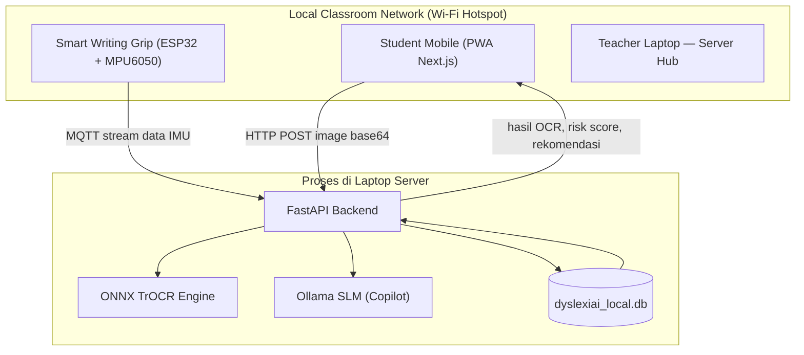

# Proposal Inovasi — Samsung Innovation Campus (SIC) / STF

---

## Identitas Proyek

| | |
|---|---|
| **Judul Proyek** | DyLeks — Ekosistem Edge-AI Offline + PWA Multi-Device dengan Smart Writing Grip untuk Skrining Dini dan Intervensi Multisensorik Anak Disleksia di Daerah 3T |
| **Tema / Bidang** | Education |
| **Kategori** | Inklusi Pendidikan, Edge AI, IoT for Social Good |

---

## 1. Latar Belakang

Di daerah **3T (Tertinggal, Terdepan, dan Terluar)** Indonesia, diperkirakan terdapat **lebih dari 5 juta anak dengan disleksia**, namun lebih dari **80% di antaranya tidak pernah terdeteksi** secara dini. Kondisi ini bukan sekadar masalah pendidikan — ini adalah krisis inklusi sosial yang meluas.

Tantangan yang dihadapi berlapis:

- **Zero-Internet Reality:** Ketiadaan koneksi internet stabil membuat platform berbasis *cloud* mustahil digunakan di pedalaman.
- **Infrastruktur Terbatas:** Sekolah hanya memiliki laptop *legacy* standar bantuan pemerintah atau *smartphone* Android milik guru/orang tua dengan spesifikasi rendah.
- **Kelangkaan Tenaga Ahli:** Tidak adanya psikolog anak atau guru inklusi membuat gejala disleksia sering salah diidentifikasi sebagai "malas belajar", sehingga anak-anak mendapat labeling negatif, mengalami trauma psikologis, hingga berakhir putus sekolah.

Hasil wawancara dengan guru dan orang tua di lapangan (representasi: Ibu Rahma, Pak Joko) mengonfirmasi: instrumen diagnosis yang ada minim, biaya dan jarak ke tenaga ahli sangat tinggi, dan belum ada solusi yang benar-benar bisa dijalankan tanpa internet.

**Pernyataan Masalah Inti:**
> *"How might we menyediakan alat skrining dan intervensi inklusif yang 100% offline, mudah digunakan oleh guru awam, dan berjalan pada laptop inventaris sekolah rendah spesifikasi di daerah 3T?"*

---

## 2. Target Pengguna

| Segmen | Deskripsi |
|---|---|
| **Primer** | Anak SD usia 6–12 tahun di wilayah 3T yang terindikasi disleksia atau disgrafia |
| **Sekunder** | Guru SD di pelosok, orang tua murid, Dinas Pendidikan daerah |

---

## 3. Deskripsi Ide dan Solusi

**DyLeks** adalah platform hibrida (*Laptop-to-Mobile*) yang berjalan **100% offline** memanfaatkan jaringan Wi-Fi lokal kelas (*Local Hotspot Setup*) tanpa kuota data. Sistem menggabungkan dua dimensi analisis yang belum pernah dikombinasikan sebelumnya untuk konteks 3T:

1. **Analisis Citra Tulisan Tangan (Visual)** — Gambar tulisan anak difoto menggunakan kamera *smartphone*, dikirim ke server laptop, lalu diproses oleh model TrOCR yang sudah dikompresi ke format ONNX agar dapat berjalan ringan tanpa GPU.

2. **Telemetri Kinematik Menulis (Fisik)** — Smart Writing Grip berbasis ESP32 + sensor IMU MPU6050 yang dipasang pada pensil biasa anak menangkap data mikro-gerakan tangan secara real-time (akselerasi, rotasi, tremor, dan hesitation) saat anak menulis di atas kertas fisik. Data ini dikirim via MQTT ke server lokal.

Penggabungan dua dimensi ini menghasilkan **diagnosis siber-fisik** yang jauh lebih akurat dibanding solusi OCR biasa.

### Alur Penggunaan (User Flow)

1. Guru menyiapkan hotspot lokal dari smartphone; laptop guru berfungsi sebagai server FastAPI.
2. Siswa menulis di kertas fisik menggunakan pensil yang dipasangi Smart Writing Grip.
3. Sensor IMU merekam trajektori dan mengirimkan stream data telemetri via MQTT ke server.
4. Guru atau orang tua memotret tulisan anak menggunakan *smartphone*; PWA mengirim gambar ke server.
5. Server menjalankan preprocessing gambar → ONNX TrOCR inference → RapidFuzz matching → analisis pola reversal, omission, dan hesitation.
6. Hasil disimpan ke `dyslexiai_local.db` dan ditampilkan sebagai *risk score*, pola kesalahan terdeteksi, serta rekomendasi latihan berbasis Orton-Gillingham.

---

## 4. Arsitektur Teknis



### Stack Teknologi

| Komponen | Teknologi | Peran |
|---|---|---|
| **Frontend Client** | Next.js 14 + PWA | UI/UX responsif untuk laptop & mobile, berjalan offline |
| **Backend Server** | FastAPI + MQTT Client | REST API + subscriber data sensor dari Smart Grip |
| **IoT Sensor** | ESP32 + MPU6050 (6-Axis IMU) | Membaca akselerasi & gyroscope saat anak menulis |
| **IoT Protocol** | Eclipse Mosquitto (MQTT) | Broker lokal berlatensi rendah, tanpa internet |
| **AI OCR Engine** | TrOCR + ONNX Runtime | Transformer OCR terkompresi, berjalan tanpa GPU diskrit |
| **Fuzzy Matching** | RapidFuzz | Pencocokan kata toleran kesalahan ketik lokal |
| **Offline LLM** | Ollama + Phi-3 / Qwen-1.5B | Small Language Model untuk Teacher's Copilot offline |
| **Database** | SQLite (`dyslexiai_local.db`) | Penyimpanan lokal seluruh data sesi dan histori anak |
| **Audio TTS** | Python gTTS / pyttsx3 | Generator audio instruksi multisensori offline |

---

## 5. Fitur Utama

| Fitur | Deskripsi |
|---|---|
| **Screening Tulisan Tangan** | Anak menulis di kertas fisik, foto dianalisis TrOCR + telemetri IMU dari Smart Grip |
| **Listen Card Multisensori** | Audio instruksi lokal diputar; anak menulis ulang apa yang didengar; sistem memberi feedback visual/audio real-time |
| **OG Cumulative Review** | Sistem menyisipkan soal lama (Level 1–2) secara otomatis saat anak naik level, berbasis *spaced repetition* Orton-Gillingham |
| **Teacher's Offline Copilot** | Guru bisa bertanya ke SLM lokal tentang strategi intervensi spesifik berdasarkan pola kesalahan anak |
| **Kinesthetic Tracer** | Papan tulis digital untuk anak menebalkan huruf dengan jari; sistem menganalisis arah stroke secara real-time |
| **Gamification & Reward** | Poin, badge, streak harian, dan tantangan mini untuk menjaga motivasi anak selama latihan |
| **Local Mesh Dashboard** | Guru memantau progress, risk score, dan pola kesalahan seluruh siswa secara live dari satu layar laptop |

---

## 6. Aspek STEM

- **Science:** Pengukuran kinematik tangan menggunakan accelerometer & gyroscope untuk analisis perilaku menulis anak secara ilmiah.
- **Technology:** Edge-AI (TrOCR → ONNX), protokol MQTT, FastAPI, dan Progressive Web App sebagai ekosistem teknologi terpadu.
- **Engineering:** Desain hardware Smart Writing Grip, kalibrasi sensor IMU, dan integrasi firmware ESP32 dengan server lokal.
- **Mathematics:** Analisis statistik risk score, algoritma fuzzy matching (Levenshtein Distance), error pattern recognition, dan metrik evaluasi model (CER, accuracy).

---

## 7. Kontribusi AI

- **TrOCR → ONNX:** Model Vision-Transformer Microsoft TrOCR di-*fine-tune* dengan dataset tulisan tangan anak Indonesia, lalu dikompresi ke ONNX agar inferensi ringan (target < 500ms per gambar di laptop low-spec).
- **RapidFuzz:** Fuzzy matching berbasis Levenshtein Distance untuk toleransi kesalahan ketik pada mode Listen Card.
- **Ollama SLM (Phi-3 / Qwen-1.5B):** Small Language Model yang berjalan lokal sebagai Teacher's Offline Copilot; memberikan rekomendasi pedagogis berbasis metode Orton-Gillingham tanpa koneksi internet.
- **Model Hybrid Visual + Kinematik:** Mengombinasikan fitur dari analisis gambar OCR dan fitur telemetri IMU (hesitation time, tremor magnitude, stroke inversion) untuk klasifikasi reversal dan disgrafia yang lebih robust.

---

## 8. Rencana Implementasi dan Evaluasi

### Timeline

| Fase | Periode | Kegiatan |
|---|---|---|
| **Fase A — Persiapan** | Bulan 0–1 | Konfigurasi hotspot, instalasi server & firmware, rekrut guru pilot |
| **Fase B — Baseline** | Bulan 2–3 | Skrining awal pada ±500 siswa dari 10 SD pilot |
| **Fase C — Iterasi** | Bulan 4 | Tuning model ONNX, penyesuaian kurikulum OG berdasarkan data lapangan |
| **Fase D — Evaluasi Akhir** | Bulan 5–6 | Uji lapangan akhir, pengukuran KPI, laporan final |

### Deliverable

| Deliverable | Estimasi Waktu |
|---|---:|
| Prototype PWA + backend minimal (ONNX inference berjalan) | 6 minggu |
| Firmware Smart Grip v1 + integrasi MQTT | 4 minggu (paralel) |
| Pilot deployment di 10 SD & pengumpulan data baseline | 8 minggu |
| Model tuning & laporan evaluasi final | 4 minggu |

### Metrik Keberhasilan (KPI)

| Metrik | Target |
|---|---|
| Cakupan sekolah pilot | Minimal 10 SD, 500 siswa |
| Akurasi klasifikasi reversal | ≥ 85% pada dataset uji lapangan |
| Adopsi guru | ≥ 80% guru pilot melaporkan peningkatan kepercayaan diri dalam intervensi |
| Waktu respons sistem | < 800ms dari foto dikirim hingga hasil muncul |
| Fungsionalitas offline | 100% fitur inti berjalan tanpa internet |

---

## 9. Data dan Privasi

- **Data yang dikumpulkan:** Foto tulisan tangan anak, data telemetri IMU (akselerasi & rotasi), metadata sesi (usia, kelas, level), serta catatan penilaian guru.
- **Perlindungan privasi:** Seluruh data disimpan lokal di laptop guru; tidak ada data yang dikirim ke cloud. Ekspor data untuk keperluan riset hanya dilakukan dalam bentuk anonymized dengan persetujuan tertulis orang tua/wali.

---

## 10. Estimasi Biaya

| Kebutuhan | Estimasi Biaya |
|---|---|
| Hardware Smart Grip per unit (ESP32 + MPU6050 + casing filamen 3D) | ± Rp 150.000/unit |
| Hardware per sekolah (10 unit Smart Grip) | ± Rp 1.500.000 |
| Operasional & workshop Train-the-Trainer per cluster sekolah | ± Rp 5.000.000 |
| Pengembangan & integrasi (tim 3–4 orang, 3 bulan) | Estimasi pada proposal anggaran terperinci |

Pendanaan awal ditargetkan dari hibah kompetisi (Samsung STF) dan program CSR. Setelah fase pilot, model distribusi beralih ke paket offline installer via USB + workshop mandiri oleh guru yang telah dilatih.

---

## 11. Dampak dan Keberlanjutan

**Dampak Langsung:**
- Mengurangi jumlah anak disleksia yang tidak terdiagnosis di area 3T sehingga intervensi dapat segera diberikan.
- Meningkatkan akses pendidikan inklusif dan menghilangkan stigma negatif terhadap anak berkebutuhan khusus.
- Membekali guru pelosok dengan alat dan pengetahuan untuk memberikan intervensi dini secara mandiri.

**Keberlanjutan:**
- **Zero operational cost** bagi sekolah pengguna — sistem sepenuhnya offline, tidak memerlukan berlangganan layanan apapun.
- **Open-source:** Desain hardware Smart Grip dan model AI tersedia publik untuk memungkinkan perbaikan dan pemeliharaan lokal oleh komunitas.
- **Skala nasional:** Potensi integrasi ke program BOS (Bantuan Operasional Sekolah) atau pendanaan CSR perusahaan teknologi untuk distribusi yang lebih luas.

---

## 12. Struktur Repositori

```
DyLeks/
├── BE/                    # FastAPI Backend (server laptop guru)
│   ├── app/api/v1/        # Endpoint screening, learning, chat
│   ├── app/services/      # TrOCR, image processor, Ollama, adaptive engine
│   ├── app/models/        # ORM SQLite (ChildProfile, Exercise, Session)
│   └── gen_audio.py       # Generator audio instruksi TTS offline
├── FE/                    # Next.js PWA (client mobile & laptop siswa)
│   ├── pages/             # screening, latihan, game, summary, dashboard
│   └── public/assets/     # Audio instruksi lokal (instruksi_ba.mp3, dst.)
├── IoT_Firmware/          # Firmware ESP32 (Arduino/C++)
│   └── smart_grip_esp32/  # Pembacaan MPU6050 + MQTT client
└── ML_Pipeline/           # Pipeline training & kompresi model
    ├── notebooks/         # EDA dan eksperimen model
    └── src/               # train.py, export_onnx.py
```

---

*Proposal ini merupakan dokumen terintegrasi untuk pengajuan DyLeks pada kompetisi Samsung Innovation Campus / STF. Detail arsitektur, flowchart sistem, dan spesifikasi teknis lengkap tersedia di `README.md` dan `ROADMAP.md`.*
