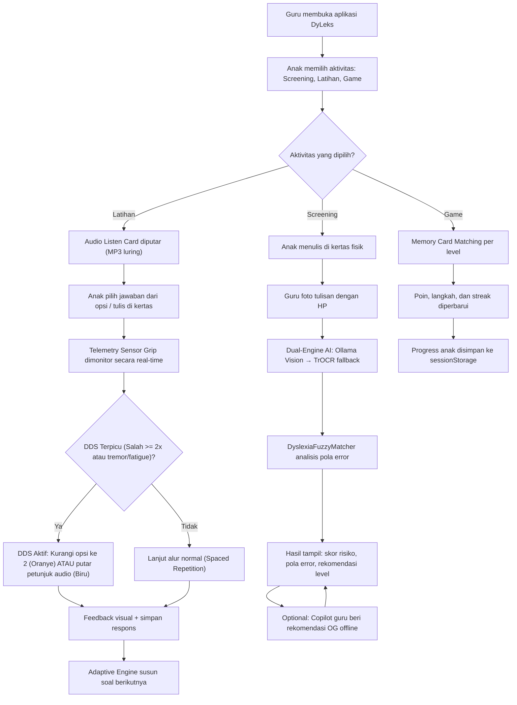

---

# DyLeks

**Ekosistem Edge-AI Offline, PWA Responsif Multi-Device, dan Sensor Fusion IoT untuk Skrining Dini serta Pembelajaran Adaptif Multisensori bagi Anak Disleksia di Daerah 3T**

> **Versi Dokumentasi:** 2.2 (Diperbarui 10 Juni 2026)  
> **Status Pengembangan:** Aktif — Fase 2.5 (Dynamic Difficulty Scaling & Telemetry Services)

---

## 1. Masalah: "The 3T Identification Vacuum" di Indonesia

Di balik pesatnya kemajuan EdTech di kota-kota besar, masih ada kesenjangan kualitas pendidikan yang masif di daerah **3T (Tertinggal, Terdepan, dan Terluar)**. Diperkirakan terdapat lebih dari **5 juta anak dengan disleksia** di Indonesia, namun **lebih dari 80% di antaranya tidak pernah terdiagnosis**.

Di daerah 3T, tantangannya berlipat ganda:

* **Zero-Internet Reality:** Ketiadaan koneksi internet stabil membuat platform berbasis *cloud* mustahil digunakan.
* **Infrastruktur Terbatas:** Sekolah tidak memiliki komputer berspesifikasi tinggi, melainkan laptop *legacy* standar bantuan pemerintah atau *smartphone* Android ramah anggaran milik guru/orang tua.
* **Scarcity of Experts:** Tidak adanya psikolog anak atau guru inklusi membuat gejala disleksia sering salah diidentifikasi sebagai "malas belajar", sehingga anak-anak kehilangan hak kesetaraan untuk berkembang.

**DyLeks** hadir sebagai solusi inklusif yang mendemokrasi akses skrining dan intervensi dini tanpa ketergantungan pada internet maupun perangkat mahal.

---

## 2. Solusi & Inovasi: Edge-AI Multi-Device Framework

**DyLeks** adalah platform hibrida (*Laptop-to-Mobile*) yang berjalan **100% secara lokal (OFFLINE)** memanfaatkan jaringan Wi-Fi lokal kelas (*Local Hotspot Setup*) tanpa kuota data:

* **Laptop-as-a-Server Hub:** Laptop guru bertindak sebagai pangkalan data lokal (`dyslexiai_local.db`) dan mesin pemroses AI utama.
* **Mobile-as-a-Client PWA:** Aplikasi *Front-End* dikemas sebagai *Progressive Web App* (PWA) yang dapat diakses dan diinstall langsung ke *smartphone* Android/iOS milik guru atau orang tua siswa via browser tanpa perlu akses ke Play Store/App Store.
* **Physical-to-Digital Pipeline:** Anak tetap menulis di atas kertas fisik menggunakan pensil untuk melatih motorik halus, lalu hasilnya difoto menggunakan kamera *smartphone* untuk dikirim ke *local server* laptop guna dianalisis.
* **Privacy-First Edge Computing:** Seluruh inferensi AI berjalan di sisi lokal perangkat, menjamin keamanan data tumbuh kembang anak-anak di pedalaman.

---

## 3. Tech Stack & Engineering Excellence

Sistem dioptimasi secara arsitektural agar mampu berjalan lancar pada perangkat komputasi standar sekolah pelosok:

| Komponen | Teknologi | Peran & Status |
| --- | --- | --- |
| **Frontend Client** | **Next.js 16 + PWA (next-pwa)** | UI/UX responsif; Service Worker offline aktif |
| **Backend Server** | **FastAPI (Python 3.9+)** | REST API berjalan di port 3002 |
| **AI OCR Engine** | **TrOCR (ONNX Runtime)** | Fallback offline dengan ONNX Runtime di backend |
| **Vision AI (Primary)** | **Ollama Vision (LLaVA/Moondream)** | Engine utama analisis tulisan tangan, adaptif terhadap spesifikasi RAM server |
| **Fuzzy Matching** | **RapidFuzz 3.10** | Deteksi pola disleksia: reversal b/d, omission, insertion, transposition |
| **Audio Scaffolding** | **Python gTTS + File MP3** | 5 file audio luring tersedia di `/public/assets/audio/` |
| **Local Database** | **SQLite (via SQLAlchemy 2.0)** | Skema relasional; Mode WAL & Synchronous NORMAL aktif untuk konkurensi tinggi |
| **Auth** | **Bcrypt + HMAC-SHA256 Token** | Isolasi data antar guru tanpa JWT overhead |
| **Offline Sync** | **Service Worker + IndexedDB** | Background Sync untuk antrian submit foto saat koneksi terputus |
| **DDS & Telemetry** | **Adaptive Dynamic Difficulty Scaling** | Deteksi frustrasi kognitif & tremor motorik sensorik real-time |
| **IoT (Direncanakan)** | **ESP32 + MPU6050 + MQTT** | Smart Writing Grip terintegrasi dengan DDS backend & FE telemetry |

---

## 4. Fitur yang Telah Diimplementasikan

### A. Progressive STEM-Infused Screening (5-Level Curriculum)

Kurikulum 5 level berbasis Orton-Gillingham tersimpan sebagai *Single Source of Truth* di `FE/lib/wordBank.ts`:

| Level | Fokus | Contoh Kata |
| --- | --- | --- |
| 1 | Huruf Vokal Tunggal | A, I, U, E, O |
| 2 | Suku Kata Dasar (KV) | BUKU, MAMA, BOLA |
| 3 | Suku Kata Kompleks (KVK) | BAN, MOBIL, RUMAH |
| 4 | Fonem Digraf & Diftong | PISANG, NYANYI, PANTAI |
| 5 | Kata Morfologi STEM | MENULIS, ENERGI, MAGNET |

### B. Gamifikasi — "Cari Pasangan Kata" (`FE/pages/game.tsx`)

* Game *memory card matching* berbasis level kurikulum.
* Kartu menampilkan kata dari level aktif siswa dan membunyikan kata saat diklik (Text-to-Speech Bahasa Indonesia).
* Sistem skor (poin per pasangan) dan jumlah langkah (efisiensi bermain).
* Modal reward bintang emas saat semua pasangan ditemukan.
* Tombol "Level Berikutnya" untuk progressi otomatis.
* Streak harian disimpan ke `sessionStorage` dan terkoneksi ke halaman Latihan.

### C. Adaptive Listen Card — Mode Latihan (`FE/pages/latihan.tsx`)

* Antarmuka "Dengar → Pilih/Tulis" multisensori.
* Menggunakan `getRandomTarget()` dan `buildQuizOptions()` dari `wordBank.ts` sebagai data source tunggal (tidak ada duplikasi data).
* Quiz pilihan ganda adaptif + 2 soal terakhir (dari 10) berbasis kamera.
* Sistem eliminasi opsi salah setelah 3x percobaan gagal.
* Progress sesi dan streak tersimpan di `sessionStorage`.

### D. Gamifikasi Cerdas: Adaptive Dynamic Difficulty Scaling (DDS)

Anak disleksia memiliki tingkat frustrasi kognitif yang tinggi jika diberi tantangan yang terlalu rumit, tetapi mudah kehilangan fokus jika materi terlalu monoton. DDS hadir untuk mengatasi ini:
* **Pemantauan Real-Time:** Sistem memantau respons waktu pengetikan/jawaban, keakuratan jawaban (kesalahan beruntun / consecutive errors >= 2), serta anomali pergerakan sensor grip secara real-time.
* **Tindakan Penurunan Kompleksitas (Scaffolding):**
  * `reduce_options`: Mengurangi opsi pilihan ganda menjadi hanya 2 pilihan (jawaban benar + 1 pengecoh acak) disertai dengan Banner Oranye di frontend (*"Jangan khawatir! Kakak bantu menyederhanakan pilihan ganda ya."*).
  * `play_audio_hint`: Memutar stimulus audio tambahan secara otomatis disertai dengan Banner Biru di frontend (*"Tanganmu lelah? Mari dengarkan suara petunjuk terlebih dahulu!"*).
* **Live Telemetry Widget & Status Indicator:** Pojok kanan layar Latihan menampilkan visualisasi status telemetri sensor grip (tremor, pressure, hesitation). Lampu status berubah menjadi MERAH berdenyut cepat (Danger State) saat terdeteksi tremor/ketidakstabilan grip motorik halus anak (> 0.6), dan kembali HIJAU saat normal.

### E. Skrining Tulisan Tangan (`FE/pages/screening.tsx`)

* Dual-Engine AI: Ollama Vision (primary) → TrOCR Transformer (fallback offline).
* Capture foto via kamera smartphone, kirim ke backend `POST /api/v1/screening/upload`.
* Output: skor risiko (0-100), label risiko, level rekomendasi, dan daftar pola kesalahan terdeteksi.

### F. Halaman Hasil & Analisis Pola (`FE/pages/result.tsx`)

* Grafik SVG distribusi frekuensi pola kesalahan (Inversi b/d, Transposisi, Omission/Insertion, Inversi p/q).
* Menampilkan detail per kata: benar/salah, error message dari backend.
* Indikasi awal berdasarkan pola error dengan disclaimer klinis.
* Rekomendasi tindak lanjut adaptif berdasarkan skor.

### G. Teacher's Offline AI Copilot (`FE/pages/copilot.tsx`)

* Antarmuka chat 100% offline dengan model bahasa kecil (Ollama lokal).
* Guru dapat bertanya rekomendasi intervensi berdasarkan pola error anak.

---

## 5. Arsitektur Backend yang Telah Diimplementasikan

### Struktur Direktori Aktual

```text
DyLeks/
├── BE/                                    # Python FastAPI Backend (port 3002)
│   ├── app/
│   │   ├── api/v1/
│   │   │   ├── auth.py                    # Register, Login, CRUD ChildProfile
│   │   │   ├── screening.py               # Endpoint analisis tulisan tangan (Dual-Engine)
│   │   │   ├── learning.py                # Endpoint mesin belajar adaptif & submit answer DDS
│   │   │   ├── chat.py                    # Endpoint AI Copilot guru luring
│   │   │   └── sync.py                    # Endpoint sinkronisasi batch sesi luring (Offline Sync)
│   │   ├── services/
│   │   │   ├── auth_service.py            # Bcrypt hashing + HMAC session token
│   │   │   ├── fuzzy_matching.py          # DyslexiaFuzzyMatcher engine
│   │   │   ├── scoring_service.py         # Wrapper ke DyslexiaFuzzyMatcher
│   │   │   ├── adaptive_engine.py         # Spaced Repetition + DDS kognitif/telemetri logic
│   │   │   ├── image_processor.py         # Preprocessing gambar: deskew, OTSU, resize
│   │   │   ├── ollama_service.py          # Chat copilot via Ollama lokal
│   │   │   ├── ollama_vision_service.py   # Analisis gambar via Ollama Vision (LLaVA)
│   │   │   ├── trocr_service.py           # ONNX Runtime fallback OCR
│   │   │   ├── ocr_service.py             # Abstraksi utilitas OCR
│   │   │   ├── hardware_diagnostic.py     # Diagnosa RAM/CPU/GPU untuk alokasi model dinamis luring
│   │   │   └── rag_service.py             # RAG semantik di memori (Cosine Similarity) berbasis file JSON
│   │   ├── models/
│   │   │   ├── user.py                    # Model User (Guru) SQLAlchemy lengkap
│   │   │   ├── child_profile.py           # ChildProfile + teacher_id FK + gender/grade
│   │   │   ├── screening_session.py       # Sesi skrining dengan FK ke child_profiles
│   │   │   └── exercise.py                # Bank soal, LearningSession, ExerciseResponse
│   │   ├── schemas/
│   │   │   ├── user_schema.py             # Pydantic: UserCreate/Login/Response + ChildProfile
│   │   │   ├── screening_schema.py        # ScreeningRequest + ScreeningResponse
│   │   │   ├── exercise_schema.py         # SubmitAnswerRequest/Response dengan metadata DDS & session_id
│   │   │   ├── sync_schema.py             # Schema untuk sinkronisasi batch offline
│   │   │   └── chat_schema.py             # Schema AI chat
│   │   └── core/
│   │       └── database.py                # SQLAlchemy engine (SQLite offline)
│   ├── gen_audio.py                       # Generator file MP3 luring via gTTS
│   ├── requirements.txt                   # Dependensi Python (termasuk rapidfuzz, bcrypt)
│   └── wsgi.py
│
├── FE/                                    # Next.js 16 Frontend (port 3001)
│   ├── pages/
│   │   ├── _app.tsx                       # Entry point: ThemeProvider + Poppins font
│   │   ├── index.tsx                      # Dashboard utama DyLeks
│   │   ├── screening.tsx                  # Ambil foto tulisan & Dual-Engine AI
│   │   ├── latihan.tsx                    # Adaptive Listen Card + Quiz + Writing (dengan telemetri DDS)
│   │   ├── game.tsx                       # Memory Card Matching per level
│   │   ├── result.tsx                     # Visualisasi pola kesalahan + rekomendasi
│   │   ├── summary.tsx                    # Ringkasan sesi
│   │   └── copilot.tsx                    # AI Teacher Copilot Chat
│   ├── components/
│   │   ├── BatMascot.tsx                  # Maskot kelelawar (dark mode)
│   │   ├── ButterflyMascot.tsx            # Maskot kupu-kupu (light mode)
│   │   └── ThemeToggle.tsx                # Toggle dark/light mode
│   ├── lib/
│   │   ├── sync_service.ts                # Sinkronisasi IndexedDB/localStorage ke server FastAPI luring
│   │   └── wordBank.ts                    # Single Source of Truth kurikulum 5-level
│   ├── styles/                            # CSS Modules per halaman + globals.css
│   ├── public/
│   │   ├── manifest.json                  # PWA manifest (install prompt)
│   │   ├── sw.js                          # Custom Service Worker (4 strategi cache)
│   │   └── assets/
│   │       ├── audio/                     # 5 file MP3 luring (A, BA, BAN, NYALA, MENEMANI)
│   │       ├── fonts/
│   │       └── *.svg                      # Ikon dan maskot
│   ├── contexts/
│   │   └── ThemeContext.tsx               # React Context dark/light mode
│   ├── next.config.js                     # Konfigurasi Next.js (next-pwa aktif)
│   └── package.json                       # next-pwa + dependencies
│
└── ML_Pipeline/                           # Pipeline Pelatihan & Kompresi Model AI
    ├── notebooks/                         # EDA dan eksplorasi data
    └── src/
        ├── train.py                       # Fine-tuning TrOCR
        └── export_onnx.py                 # Konversi PyTorch → ONNX
```

---

## 6. Skema Database (SQLite Lokal)

Skema didesain dengan prinsip **Privacy-First**: data siswa terisolasi per guru secara struktural di level database, bukan hanya di level aplikasi.

```
users (Guru)
├── id (PK, UUID)
├── full_name, username, hashed_password (bcrypt)
├── school_name, school_region
├── is_active, created_at, last_login
└── → child_profiles (One-to-Many, cascade delete)

child_profiles (Siswa)
├── id (PK, UUID)
├── teacher_id (FK → users.id, CASCADE)  ← [KUNCI privasi]
├── name, age, gender, grade
├── current_level (1-5), risk_score, risk_level
├── teacher_notes
└── → screening_sessions, learning_sessions

screening_sessions
├── id (PK, UUID)
├── child_id (FK → child_profiles.id)
├── risk_score, risk_level, recommended_level
└── feedback, created_at

exercises (Bank Soal)
├── id, level (1-5), type, content (JSON)
└── correct_answer

learning_sessions & exercise_responses
└── Tracking respons anak per soal per sesi
```

---

## 7. API Endpoints (Backend v1.3.0)

### Auth & User Management (`/api/v1/auth`)
| Method | Endpoint | Fungsi |
|---|---|---|
| POST | `/register` | Daftarkan guru baru ke server lokal |
| POST | `/login` | Login guru, kembalikan HMAC session token |
| POST | `/children` | Tambah profil siswa (butuh auth) |
| GET | `/children` | Daftar semua siswa milik guru login |
| GET | `/children/{id}` | Detail profil satu siswa |
| PATCH | `/children/{id}` | Perbarui profil siswa |
| DELETE | `/children/{id}` | Hapus siswa + cascade data sesi |

### Screening (`/api/v1/screening`)
| Method | Endpoint | Fungsi |
|---|---|---|
| POST | `/upload` | Analisis foto tulisan tangan (Dual-Engine) |

### Learning (`/api/v1/learning`)
| Method | Endpoint | Fungsi |
|---|---|---|
| GET | `/get-exercises/{level}` | Ambil soal adaptif (Spaced Repetition) |
| POST | `/submit-answer` | Submit jawaban kognitif & parameter sensor grip (DDS) |

### Offline Sync (`/api/v1/sync`)
| Method | Endpoint | Fungsi |
|---|---|---|
| POST | `/batch` | Kirim batch antrean sesi offline dari PWA client untuk diproses secara paralel |

### AI Copilot (`/api/v1/chat`)
| Method | Endpoint | Fungsi |
|---|---|---|
| POST | `/` | Chat dengan Ollama SLM lokal (terintegrasi RAG semantik luring) |

---

## 8. DyslexiaFuzzyMatcher Engine

Modul `BE/app/services/fuzzy_matching.py` adalah jantung pedagogis DyLeks. Berbeda dari OCR biasa yang hanya membaca "apa yang tertulis", mesin ini mendeteksi **mengapa tulisan itu salah secara klinis**:

| Tipe Error | Contoh | Mekanisme Deteksi |
|---|---|---|
| **Reversal b/d** | "buku" → "duku" | Bobot klinis 1.8x, deteksi posisi per karakter |
| **Reversal p/q** | "pagi" → "qagi" | Bobot klinis 1.8x |
| **Transposition** | "batu" → "tabu" | Anagram check (sorted chars match) |
| **Omission** | "bango" → "bao" | Panjang token fonetik berkurang |
| **Insertion** | "buku" → "bukuu" | Panjang token fonetik bertambah |

**Fitur khusus Bahasa Indonesia:**
- Digraf (NG, NY, KH, SY) diperlakukan sebagai satu unit fonetik.
- Diftong (AI, AU, OI) dikenali saat tokenisasi.

**Output batch session:** Frekuensi error, dominant error type, skor risiko agregat, dan rekomendasi intervensi Orton-Gillingham yang spesifik per pola error.

---

## 9. Protokol Offline-First (PWA) & Sync Queue

DyLeks menggunakan 4 strategi cache berbeda di Service Worker (`FE/public/sw.js`):

| Strategi | Diterapkan pada | Alasan |
|---|---|---|
| **Cache-First** | Audio MP3, SVG, Font, Ikon | Aset statis tidak pernah berubah saat runtime |
| **Stale-While-Revalidate** | JS/CSS chunk Next.js | Tampilkan cepat dari cache, update di background |
| **Network-First** | Halaman HTML (navigate) | Prioritas data segar jika ada koneksi |
| **LocalStorage Queue** | Antrean foto tulisan tangan | Antrean lokal ketika koneksi ke laptop server putus |

### A. Pilar 1: Risk Assessment Engine (Sesi Agregat)
* **Penyimpanan Database SQLite**: Sesi skrining yang selesai dianalisis akan dikirim ke endpoint `POST /api/v1/screening/submit-session` untuk disimpan ke tabel `screening_sessions`.
* **Sinkronisasi Profil Siswa**: Kolom `risk_score`, `risk_level`, dan `current_level` (direkomendasikan 1-5) pada tabel `child_profiles` otomatis diperbarui berdasarkan hasil skrining agregat.

### B. Pilar 2: Mekanisme Antrean Luring & Sinkronisasi Batch
* **Kompresi Kamera Luring**: Saat offline, tangkapan kamera dikompresi menjadi **400x400 piksel** (JPEG 0.6) dengan ukuran berkas ~20KB-30KB per gambar untuk mencegah batas memori *LocalStorage* penuh.
* **Batch Sync API**: Saat koneksi Wi-Fi ke laptop server guru pulih kembali, klien memicu `POST /api/v1/sync/batch` yang memproses OCR semua gambar secara paralel/sekuensial dan menyimpan hasil analisis agregat ke database SQLite lokal.

**Pre-cache saat install (Service Worker):**
- Semua 8 halaman utama (`/`, `/screening`, `/latihan`, `/game`, `/result`, `/summary`, `/copilot`)
- Semua 5 file audio luring
- `manifest.json` dan aset SVG

**Halaman offline fallback:** Jika cache miss dan network mati, browser menampilkan halaman custom berdesain gelap dengan petunjuk koneksi ke Wi-Fi guru — bukan halaman error bawaan browser.

---

## 10. Alur Operasional Kelas Luring (Classroom Workflow)

Untuk memaksimalkan penggunaan DyLeks di daerah 3T yang serba luring (tanpa internet), ikuti protokol operasional kelas terstruktur berikut dari awal guru masuk kelas hingga pembelajaran selesai:

### Tahap 1: Persiapan Kelas (5 Menit Sebelum Pembelajaran)
1. **Nyalakan Hotspot Lokal:** Guru menyalakan router Wi-Fi kelas luring (atau mengaktifkan hotspot pribadi dari smartphone guru tanpa kuota data).
2. **Koneksikan Perangkat:** Hubungkan laptop guru (Server) ke jaringan Wi-Fi lokal kelas tersebut.
3. **Nyalakan Server Hub DyLeks:** Guru menjalankan skrip `setup_services.bat` (atau menjalankan manual Next.js & FastAPI luring).
4. **Buka Dashboard:** Guru membuka peramban laptop dan mengakses `http://localhost:3001/dashboard`, lalu masuk menggunakan kredensial guru.

### Tahap 2: Sambungan Mandiri Siswa (5 Menit Pertama Kelas)
1. **Hubungkan Wi-Fi Siswa:** Anak-anak menyalakan Wi-Fi pada smartphone masing-masing dan menyambungkannya ke Wi-Fi kelas luring yang sama.
2. **Pindai QR Code:**
   - Guru membuka modal **"Hubungkan Siswa (QR)"** di Dashboard Guru.
   - Anak-anak membuka PWA DyLeks di HP mereka dan mengklik tombol pemindai untuk memindai QR Code di layar laptop guru.
   - HP siswa secara otomatis mendeteksi alamat IP server lokal guru dan menyetelnya secara asinkron tanpa input manual.
   - Anak memilih profil namanya pada layar HP untuk terhubung secara instan.
3. **Otomatisasi Antrean:** Begitu anak A terhubung, laptop guru memutar bunyi bel sukses luring ("ting-ting") dan otomatis meregenerasi QR Code baru dalam 3 detik untuk dipindai oleh siswa berikutnya hingga seluruh kelas terhubung.

### Tahap 3: Aktivitas Belajar Luring & Pemantauan (30 Menit Inti Pembelajaran)
1. **Mulai Belajar Adaptif:** Anak-anak mulai mengerjakan soal latihan di HP masing-masing atau bermain game pencarian kata (Memory Card) luring.
2. **Pemantauan Kognitif Aktif (DDS):** 
   - Selama anak belajar, laptop guru secara asinkron memantau waktu respons dan telemetri tremor grip pensil anak.
   - Jika anak mengalami kebingungan (salah $\ge 2$ kali berturut-turut) atau kelelahan motorik, backend menginstruksikan HP siswa untuk otomatis mengaktifkan mode DDS (mengurangi pilihan ganda dari 4 menjadi 2 opsi atau memutar panduan suara).
3. **Skrining Tulisan Tangan:** Untuk latihan motorik menulis fisik, anak menulis di kertas biasa, kemudian guru mengambil foto tulisan anak menggunakan kamera HP, lalu mengunggahnya ke server laptop guru untuk dianalisis luring oleh model AI Vision.

### Tahap 4: Evaluasi & Penutupan Kelas (5 Menit Terakhir Kelas)
1. **Sesi Latihan Berakhir:** Siswa menyelesaikan pembelajaran harian mereka. Seluruh data skor dan jenis kesalahan tersimpan rapi secara lokal di database SQLite laptop guru.
2. **Review Dashboard Guru:** Guru membuka panel detail siswa di Dashboard Guru laptop untuk meninjau jenis kesalahan anak hari itu (misal: "sering membalik huruf b/d").
3. **Catatan Pedagogis Orton-Gillingham:** Guru langsung menuliskan catatan evaluasi intervensi (seperti: *"rekomendasi latihan taktil menulis huruf b/d di atas pasir di kelas esok hari"*). Catatan ini tersimpan secara terenkripsi transparan di database demi keamanan privasi anak.
4. **Shutdown Server:** Guru mematikan server lokal dan router Wi-Fi. Kelas ditutup dengan aman.

---

## 11. Langkah Memulai Pengembangan (Local Development Guide)

### Prasyarat Infrastruktur Kelas 3T (Simulasi)

1. Sediakan satu router Wi-Fi tanpa internet (atau aktifkan fitur *Tethering/Hotspot* dari *smartphone*).
2. Hubungkan Laptop (Server) dan *smartphone* (Client) ke jaringan Wi-Fi yang sama.

### Menjalankan Backend (Laptop Guru — Terminal A)

```bash
cd BE
pip install -r requirements.txt
python -m app.services.hardware_diagnostic  # Opsional: jalankan cek spesifikasi luring
uvicorn app.main:app --host 0.0.0.0 --port 3002 --reload
```

Backend API tersedia di `http://localhost:3002` dan `http://[IP-LOKAL-LAPTOP]:3002`.

### Setup Teacher's Copilot (Opsional — Ollama)

```bash
# Install Ollama terlebih dahulu dari https://ollama.ai
ollama run qwen1.5:1.8b
# atau: ollama run phi3:mini
```

Pastikan URL Ollama di `BE/app/core/config.py` mengarah ke `http://localhost:11434`.

### Menjalankan Frontend (Terminal B)

```bash
cd FE
npm install
npm run dev
# Dev server berjalan di http://localhost:3001
```

Dari smartphone yang terhubung ke Wi-Fi yang sama, buka `http://[IP-LOKAL-LAPTOP]:3001`.
Klik **"Add to Home Screen"** di browser untuk menginstall sebagai PWA offline.

---

## 12. Flowchart Diagram Alur Sistem



---

## 13. Riset Pengguna & Validasi Lapangan (Pilot Project)

Pengembangan **DyLeks** dilandasi oleh riset kualitatif mendalam terhadap pengguna riil di sekolah dasar pelosok:

* **Studi Kasus 1 (Siswa):** Daniel (Desa Dayeuhkolot), seorang remaja mantan penyandang disleksia. Akibat ketiadaan diagnosis dini di sekolah dasarnya (SDN Dayeuhkolot 12), ia sering dilabeli malas karena kesulitan membedakan huruf 'b'/'d'. Hal ini meninggalkan trauma akademik dan menurunkan rasa percaya dirinya secara permanen.
* **Studi Kasus 2 (Guru):** Ibu Yuli (Guru, SD Negeri Dayeuhkolot 12), mengalami dilema pedagogis berat di lapangan karena kesulitan membedakan anak disleksia dengan anak lambat belajar (*slow learner*) tanpa instrumen asesmen yang objektif.
* **Hasil Uji Coba Awal (Pilot Project):** Prototipe awal DyLeks diuji coba pada 20 anak di SD Negeri Dayeuhkolot 12. Sistem berhasil mendeteksi potensi disleksia dengan tingkat kecocokan observasi guru sebesar **90%** (18 dari 20 siswa teridentifikasi dengan tepat), serta mengklasifikasikan 4 siswa dengan risiko disleksia sedang hingga tinggi.

---

## 14. Arsitektur Deployment Luring (Penyelesaian Mixed Content)

Untuk memenuhi karakteristik daerah 3T (*Zero-Internet*) dan mematuhi batasan keamanan peramban web modern, DyLeks menerapkan strategi *deployment* sebagai berikut:

### Fully Local Offline Deployment (HTTP-to-HTTP)

1. **Frontend Next.js** berjalan di laptop server guru pada **port 3001** (HTTP).
2. **Backend FastAPI** berjalan di laptop server guru pada **port 3002** (HTTP).
3. **Penyelesaian Mixed Content Blocking:** Dengan menjaga agar Frontend dan Backend berjalan dalam protokol HTTP murni yang sama di jaringan Wi-Fi kelas (`http://192.168.x.x`), peramban klien tidak akan memblokir request API. Hal ini menyelesaikan isu *Mixed Content Blocking* yang terjadi jika frontend dihost di HTTPS publik.
4. **PWA Offline Installation:** PWA Next.js dapat dipasang langsung ke layar utama (*Add to Home Screen*) peramban siswa melalui alamat IP lokal server tanpa koneksi internet sama sekali.
5. **Skrip Otomatisasi Startup (Background Services)**: Untuk mengonfigurasi auto-start server Next.js & FastAPI secara transparan tanpa membuka cmd manual, gunakan berkas [setup_services.bat](file:///d:/4. Thoriq_KULIAH/1.Lomba Thoriq/SEMESTER 4/05. Samsung/DyLeks/setup_services.bat) (butuh hak Administrator). Skrip ini mendaftarkan layanan ke Windows Task Scheduler dengan trigger `onlogon` dan hak akses tertinggi (`/rl HIGHEST`).
6. **Panduan Setup DNS & Wi-Fi Kelas (Zero-IP Portal)**: Untuk memetakan alamat IP lokal server guru ke domain `dyleks.id` atau `dyleks.local` pada router Wi-Fi kelas luring, ikuti panduan lengkap di [dns_setup_guide.md](file:///d:/4. Thoriq_KULIAH/1.Lomba Thoriq/SEMESTER 4/05. Samsung/DyLeks/docs/dns_setup_guide.md).
7. **Optimasi SQLite WAL (Write-Ahead Logging)**: Mencegah error database locked pada luring dengan mengaktifkan mode WAL (`PRAGMA journal_mode=WAL;` dan `PRAGMA synchronous=NORMAL;`) via SQLAlchemy connection listener untuk mengatasi sinkronisasi konkuren tinggi dari client.

### Isolasi Data Sekolah (Zero-Config Multitenancy)

* Setiap laptop guru menjalankan instans *local database SQLite* (`dyslexiai_local.db`) mandiri.
* Model autentikasi berbasis `teacher_id` memastikan data siswa satu guru tidak bisa diakses oleh guru lain meskipun terhubung ke jaringan lokal yang sama.
* Data anak terjaga kerahasiaannya secara penuh — tidak ada data yang keluar ke server eksternal.

---

## 15. Status Sprint & Roadmap

| Sprint | Fokus | Status |
|---|---|---|
| **Sprint 0** | Bug fixes, port alignment (3001/3002), SQLite stabilisasi | Selesai |
| **Sprint 1** | Adaptive Engine (Spaced Repetition), Scoring Service | Selesai |
| **Sprint 2** | TrOCR ONNX, Ollama Vision integration, Image Preprocessing | Selesai |
| **Sprint 3** | Game Memory Card, Halaman Result visualisasi, UI/UX refinement | Selesai |
| **Sprint 3.5** | Auth Guru (bcrypt + HMAC token), DyslexiaFuzzyMatcher engine, PWA Service Worker, Pilar 1 (Risk Assessment Engine SQLite), Pilar 2 (Offline PWA Sync Batch Queue) | **Selesai** |
| **Sprint 3.6** | Peningkatan Stabilitas Edge Server (Auto-Start Script, SQLite WAL Mode, Local DNS Setup & Docs) | **Selesai** |
| **Sprint 3.7** | Gamifikasi Cerdas Adaptive Dynamic Difficulty Scaling (DDS) & Telemetri Sensor Grip Real-Time | **Selesai** |
| **Sprint 4** | IoT Smart Writing Grip (ESP32 + MPU6050 + MQTT) | Belum dimulai (tunggu hardware) |

---

## 16. Success Metrics

| Metric | Target | Keterangan |
|---|---|---|
| **System Uptime** | 99.5% | Ketersediaan server lokal di sekolah pilot |
| **Average Response Time** | < 800ms | Latensi API dari kamera ke hasil |
| **OCR Accuracy** | > 85% | Character Error Rate pada dataset Indonesia |
| **Device Compatibility** | 90%+ | % HP Android yang bekerja tanpa masalah |
| **User Satisfaction** | > 4.0/5.0 | Skor feedback guru |
| **Data Sync Reliability** | 100% | Zero data loss saat offline-online |
| **Offline Functionality** | 100% | Sistem bekerja penuh tanpa internet |
| **Student Engagement** | > 80% | % siswa menyelesaikan semua 5 level |

---

**Terakhir Diperbarui:** 10 Juni 2026  
**Versi Dokumen:** 2.2 (Pilar 4 — Adaptive DDS & Telemetry)  
**Dikelola Oleh:** Tim Pengembang DyLeks (TELULANG)  
