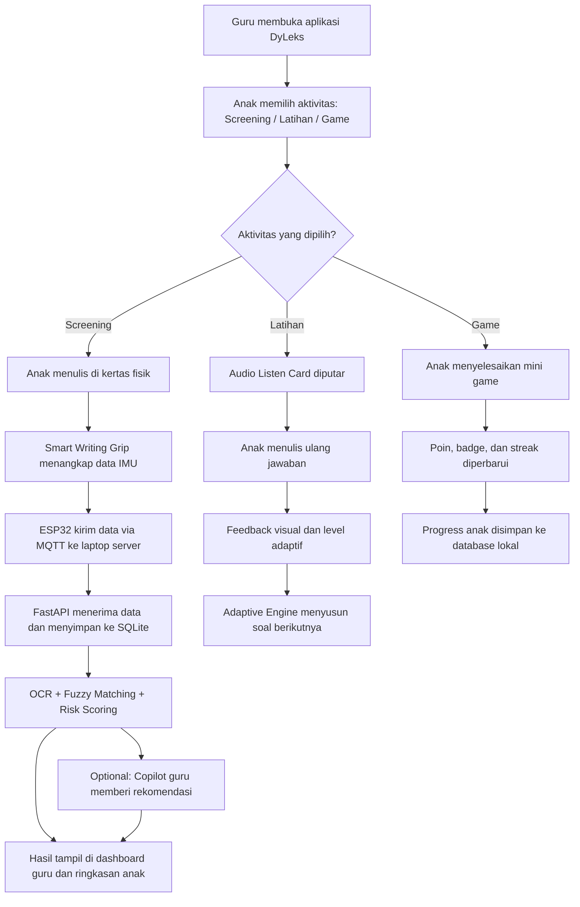
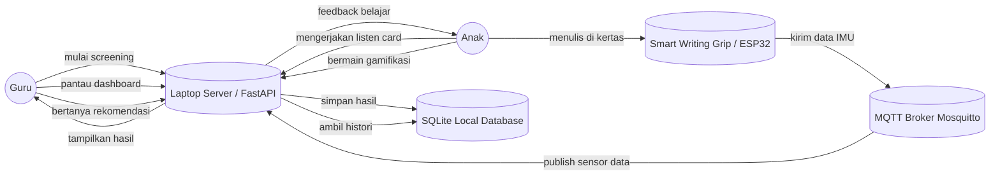
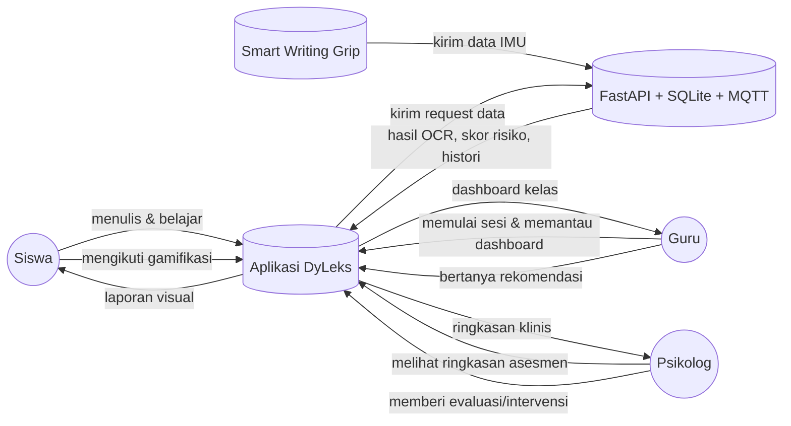

---
# `DyLeks`

**Ekosistem Edge-AI Offline, PWA Multi-Device, dan Sensor Fusion IoT untuk Skrining Dini serta Pembelajaran Adaptif Multisensori bagi Anak Disleksia di Daerah 3T**
---
## 1. Masalah: "The 3T Identification Vacuum" di Indonesia

Di balik pesatnya kemajuan EdTech di kota-kota besar, masih ada kesenjangan kualitas pendidikan yang masif di daerah **3T (Tertinggal, Terdepan, dan Terluar)**. Diperkirakan terdapat lebih dari **5 juta anak dengan disleksia** di Indonesia, namun **lebih dari 80% di antaranya tidak pernah terdiagnosis**.

Di daerah 3T, tantangannya berlipat ganda:

* **Zero-Internet Reality:** Ketiadaan koneksi internet stabil membuat platform berbasis *cloud* mustahil digunakan.
* **Infrastruktur Terbatas:** Sekolah tidak memiliki komputer berspesifikasi tinggi, melainkan laptop *legacy* standar bantuan pemerintah atau *smartphone* Android ramah anggaran milik guru/orang tua.
* **Scarcity of Experts:** Tidak adanya psikolog anak atau guru inklusi membuat gejala disleksia sering salah diidentifikasi sebagai "malas belajar", sehingga anak-anak kehilangan hak kesetaraan untuk berkembang.

**DyLeks** hadir sebagai solusi inklusif yang mendemokrasi akses skrining dan intervensi dini tanpa ketergantungan pada internet maupun perangkat mahal.

---

## 2. Solusi & Inovasi: Edge-AI Multi-Device Framework

**DyLeks** adalah platform hibrida (*Laptop-to-Mobile*) yang berjalan **100% secara lokal (OFFLINE)** memanfaatkan jaringan Wi-Fi lokal kelas (*Local Hotspot Setup*) tanpa kuota data:

* **Laptop-as-a-Server Hub:** Laptop guru bertindak sebagai pangkalan data lokal (`dyslexiai_local.db`) dan mesin pemroses AI utama.
* **Mobile-as-a-Client PWA:** Aplikasi *Front-End* dikemas sebagai *Progressive Web App* (PWA) yang dapat diakses dan diinstal langsung ke *smartphone* Android/iOS milik guru atau orang tua siswa via browser tanpa perlu akses ke Play Store/App Store.
* **Physical-to-Digital Pipeline:** Anak tetap menulis di atas kertas fisik menggunakan pensil untuk melatih motorik halus, lalu hasilnya difoto menggunakan kamera *smartphone* untuk dikirim ke *local server* laptop guna dianalisis.
* **Bio-Kinesthetic Handwriting Tracking:** Anak tetap menulis secara natural di atas kertas fisik menggunakan pensil biasa yang dipasangi Smart Writing Grip. Sensor IMU pada grip menangkap mikro-gerakan (akselerasi dan rotasi) tangan anak saat membentuk huruf, sehingga sistem memperoleh dimensi data kinematik baru sebelum kertas difoto untuk proses OCR.
* **Privacy-First Edge Computing:** Seluruh inferensi AI berjalan di sisi lokal perangkat, menjamin keamanan data tumbuh kembang anak-anak di pedalaman.

---

## 3. Tech Stack & Engineering Excellence (Optimized for Low-Spec Devices)

Sistem dioptimasi secara arsitektural agar mampu berjalan lancar pada perangkat komputasi standar sekolah pelosok melalui kompresi model ke format **ONNX Runtime**:

| Komponen                            | Teknologi                               | Peran & Optimalisasi 3T                                                                                                                                      |
| ----------------------------------- | --------------------------------------- | ------------------------------------------------------------------------------------------------------------------------------------------------------------ |
| **Frontend Client** | **Next.js 14 + PWA** | UI/UX responsif untuk Laptop & Mobile; performa rendering luring. |
| **Backend Server** | **FastAPI + MQTT Client** | Mengelola REST API sekaligus menjadi subscriber pesan MQTT untuk menangkap data sensor dari grip secara asinkron. |
| **IoT Microcontroller** | **ESP32 DevKit v1** | Menjadi otak pada grip pensil; membaca data sensorik mentah lokal dan mentransmisikannya via Wi-Fi lokal kelas. |
| **Hardware Sensor** | **IMU MPU6050 (6-Axis)** | Mengombinasikan 3-axis Accelerometer dan 3-axis Gyroscope untuk mendeteksi getaran, kecepatan, dan sudut kemiringan tarikan garis tangan anak. |
| **IoT Broker Protocol** | **Eclipse Mosquitto (MQTT)** | Message broker ringan yang di-host lokal di laptop guru untuk menjamin pengiriman data sensorik berlatensi rendah tanpa internet. |
| **AI OCR Engine** | **TrOCR + ONNX Web** | Model Vision-Transformer (Microsoft/trocr-base) yang dikompresi ke format ONNX agar inferensi tulisan tangan berjalan sangat ringan tanpa butuh GPU diskrit. |
| **Fuzzy Matching** | **RapidFuzz** | Algoritma pencocokan kata lokal dengan efisiensi tinggi untuk toleransi kesalahan ketik ringan pada Listen Card. |
| **Audio Scaffolding** | **Python TTS Generator** | Memproduksi petunjuk vokal luring (`gen_audio.py`) untuk memandu siswa pelosok dengan pendekatan multisensori. |
| **Local Database** | **SQLite** | Menyimpan koordinat sensorik dan pola kinematik menulis anak bersama hasil akhir asesmen. |
| **Offline LLM Engine** | **Ollama + Phi-3 / Qwen-1.5-B** | Menjalankan Small Language Model (SLM) terkompresi secara lokal di laptop untuk mengotaki Teacher's Copilot tanpa internet. |
| **Kinesthetic Tracer Engine** | **Smart Writing Grip + MQTT Telemetry** | Menangkap data trajektori, tremor, dan hesitation saat anak menulis di kertas fisik. |

---

## 4. Fitur Utama & Muatan Kurikulum STEM

### A. Progressive STEM-Infused Screening (5-Level Curriculum)

Proses skrining tidak hanya menguji bahasa baku, melainkan menyuntikkan muatan literasi sains dan matematika dasar (STEM) untuk sekaligus mengakselerasi pengetahuan sains anak:

* **Level 1 (Huruf Tunggal):** Deteksi awal orientasi karakter visual (e.g., Mengenali simbol angka/huruf 'A').
* **Level 2 (Suku Kata):** Menguji penggabungan konsonan-vokal bertema alam (e.g., 'BA' pada kata Batu).
* **Level 3 (Suku Kata Kompleks):** Deteksi inversi dan omisi pada istilah sains dasar (e.g., 'BAN' pada kata Banjir).
* **Level 4-5 (Kata & Morfologi STEM):** Analisis kelancaran penulisan kata utuh sains populer (e.g., 'NYALA' pada konsep api/energi, 'MENEMANI').

### B. Interactive Listen Card (Aksen & Dialek Lokal)

Antarmuka "Dengarkan-Lalu-Tulis" yang dilengkapi dengan *audio scaffolding* lokal (`gen_audio.py`). Aplikasi memberikan jeda intuitif dan kartu berubah warna secara visual saat audio dimainkan untuk menjaga fokus anak disleksia yang mudah terdistraksi.

### C. Comprehensive Local Summary & Risk Analytics

* **Risk Score Analysis:** Memberikan klasifikasi tingkat risiko disleksia anak (Rendah, Sedang, Tinggi) berdasarkan akurasi segmentasi gambar tulisan tangan.
* **Error Pattern Recognition:** Mendeteksi kesalahan khas disleksia seperti *reversal* (huruf tertukar/terbalik seperti b/d, p/q) atau *omission* (huruf yang hilang) secara otomatis menggunakan AI lokal.
* **Learning Roadmaps:** Secara otomatis menyusun modul rekomendasi belajar adaptif intervensi mandiri bagi guru di pelosok berdasarkan *error pattern* anak.

### D. Mode Belajar Adaptif Berbasis Orton-Gillingham

* Modul intervensi dinamis (`adaptive_engine.py`) yang melatih anak membaca menggunakan kombinasi tiga sensor: penglihatan (visual), pendengaran (auditori), dan gerakan tangan/sentuhan (kinestetik) secara berulang dan terstruktur.
* **Dynamic Feedback:** Kesulitan kata akan meningkat atau menurun secara otomatis menyesuaikan kecepatan respons dan ketepatan anak saat menyelesaikan tantangan membaca offline.

### E. Orton-Gillingham Cumulative Review & Phonogram Matrix

* **Cumulative Spaced-Repetition System:** `adaptive_engine.py` diperluas menjadi `Cumulative Drill Engine` sehingga saat anak masuk Level 3, sistem otomatis menyisipkan 15–20% soal dari Level 1 dan Level 2 secara acak agar pola huruf lama tetap terjaga di memori jangka panjang.
* **Indonesian Phonogram Mapping Database:** Skema `dyslexiai_local.db` diperbarui dengan tabel `indonesian_phonogram_matrix` untuk menyimpan urutan fonem bahasa Indonesia dari yang paling mudah ke yang paling sulit.
* **Cakupan Fonetik:** Digraf Melayu seperti `NG`, `NY`, `KH`, `SY`, serta diftong `AI`, `AU`, `OI` dilatih lewat modul audio dan penulisan sebelum anak naik ke teks morfologi sains yang lebih panjang.
* **Nilai Juri SFT:** Menunjukkan bahwa DyLeks tidak hanya adaptif, tetapi juga mengikuti prinsip inti Orton-Gillingham yang sistematis, kumulatif, dan berbasis urutan fonetik.

### F. Teacher’s Offline AI Pedagogical Copilot (Asisten Konsultasi Guru Luring)

* **Mekanisme AI:** Memanfaatkan modul `ollama_service.py` dan `chat.py` untuk menjalankan *Small Language Model* (SLM) yang telah dikompresi di dalam server laptop guru^^.
* **Cara Kerja:** Karena di daerah 3T tidak ada psikolog atau pakar disleksia, guru sering kebingungan menghadapi anak yang memiliki pola kesalahan tertentu. Fitur ini menyediakan ruang *chatting* 100% offline^^. Guru bisa bertanya: *"Anak X di Level 3 sering membalik huruf b dan d, latihan taktil apa yang paling cocok untuk besok?"* AI lokal akan memberikan rekomendasi pedagogis berbasis metode Orton-Gillingham secara instan^^.
* **Nilai Juri SFT:** Mengubah platform yang awalnya hanya "alat tes" menjadi **"asisten guru cerdas"** yang menyelesaikan kelangkaan tenaga ahli di pelosok.

### G. Interactive Kinesthetic Tracer (Digital Whiteboard Stroke Analysis)

* **Mekanisme STEM:** Memanfaatkan modul `digital_whiteboard.py` pada antarmuka *tablet* atau *smartphone*^^.
* **Cara Kerja:** Anak disleksia tidak hanya kesulitan melihat huruf, tetapi juga bingung arah menulisnya (misal menulis huruf 'd' dimulai dari garis vertikal dulu atau lingkaran dulu). Lewat fitur papan tulis digital ini, anak diminta menebalkan huruf di layar menggunakan jari^^. AI tidak hanya menilai hasil akhir tulisan, tetapi juga menganalisis **arah tarikan garis (stroke direction)** secara  *real-time* . Jika arahnya salah, sistem akan memberikan *feedback* visual yang interaktif.
* **Nilai Juri SFT:** Sangat menonjolkan pilar *Engineering* dan *Technology* dalam STEM.

### H. Local Mesh Dashboard & Analytics (Pusat Kendali Kelas Inklusi)

* **Mekanisme Sistem:** Sinkronisasi multi-device terenkripsi berbasis Wi-Fi lokal ke pangkalan data `dyslexiai_local.db`^^.
* **Cara Kerja:** Menyediakan halaman dasbor khusus untuk guru di laptop server^^. Ketika 5 hingga 10 siswa sedang melakukan tes menggunakan HP Android secara serentak di kelas, guru dapat memantau progres, kecepatan respons, dan skor risiko masing-masing anak secara *live* dari satu layar laptop^^.
* **Nilai Juri SFT:** Memperkuat kriteria Kelayakan Implementasi. Juri melihat bahwa sistem ini sangat efisien dan siap pakai untuk skala satu kelas di sekolah pedalaman.

### I. IoT Bio-Kinesthetic Handwriting Analyzer (Smart Writing Grip)

* **Mekanisme Sistem:** Perangkat Smart Writing Grip menangkap data trajektori menulis anak langsung dari pensil fisik melalui protokol MQTT ke backend FastAPI^^.
* **Fungsi AI Lokal:** Algoritma pattern recognition pada laptop server menganalisis proses kinematik penulisan^^.
   * **Hesitation Detection:** Mengukur jeda waktu berhenti (ragu-ragu) anak saat menyambung suku kata^^.
   * **Tremor Analysis:** Mendeteksi getaran tangan berlebih akibat kecemasan kognitif (*anxiety spike*)^^.
   * **Inversion Stroke Detection:** Menganalisis apakah arah putaran tangan terbalik (misal membentuk perut huruf 'd' atau 'b' dari bawah ke atas) yang menjadi ciri khas disgrafia/disleksia^^.
* **Nilai Juri SFT:** Menambahkan dimensi *sensor fusion* dan *embedded system* sehingga solusi lebih kuat secara engineering.

### J. Gamification & Reward System (Motivasi Belajar Anak)

* **Mekanisme Sistem:** Menambahkan elemen permainan edukatif untuk menjaga motivasi anak selama screening dan latihan mandiri^^.
* **Cara Kerja:** Anak memperoleh poin, badge, bintang progres, dan tantangan harian setelah menyelesaikan latihan membaca, menulis, atau tracing^^. Sistem memberikan feedback visual dan audio yang positif agar anak tetap tertarik belajar tanpa merasa terbebani^^.
* **Contoh Mode Game:** Matching huruf atau suku kata, tebak kata dari audio, trace-the-letter challenge, dan streak challenge harian^^.
* **Nilai Juri SFT:** Menambah aspek *engagement* dan *usability* sehingga sistem tidak hanya fungsional, tetapi juga lebih menarik bagi anak disleksia.

### K. Visual Use Case Ringkas per Fitur

| Fitur | Use Case Utama | Output Visual |
|---|---|---|
| Screening | Guru memilih level, anak menulis, sistem memberi skor | Progress bar, skor risiko, hasil OCR |
| Listen Card | Anak mendengar audio lalu menulis ulang | Kartu audio, highlight warna, feedback benar/salah |
| OG Cumulative Review | Sistem menyisipkan materi lama saat level baru | Matriks fonogram, jadwal review, indikator mastery |
| IoT Handwriting Analyzer | Grip mengirim data tulisan ke server | Grafik tremor, hesitation, stroke pattern |
| Gamification | Anak menyelesaikan misi dan mendapat reward | Badge, bintang, poin, streak harian |

---

## 5. Struktur Arsitektur Kode Utama

Peta repositori aplikasi untuk memudahkan pembagian tugas tim pengembang:

```text
DyLeks/
├── BE/                           # Python FastAPI Backend (Local Server Hub)
│   ├── app/
│   │   ├── api/v1/
│   │   │   ├── screening.py      # Endpoint manajemen sesi skrining anak
│   │   │   ├── learning.py       # Endpoint mesin belajar adaptif
│   │   │   └── chat.py           # Endpoint asisten panduan guru luring
│   │   ├── services/
│   │   │   ├── mqtt_handler.py   # Mengelola komunikasi data MQTT dari ESP32
│   │   │   ├── kinesthetic_analyzer.py # Ekstraksi fitur tremor & kecepatan menulis
│   │   │   ├── adaptive_engine.py# Otak algoritma personalisasi tingkat kesulitan
│   │   │   ├── image_processor.py# Pipeline prapemrosesan gambar tulisan tangan
│   │   │   ├── trocr_service.py  # Model Vision-Transformer berbasis ONNX Runtime
│   │   │   └── ocr_service.py    # Abstraksi utilitas OCR teks luring
│   │   ├── models/               # ORM Skema SQLite (user, child_profile, session)
│   │   ├── schemas/              # Pydantic data validation schemas
│   ├── gen_audio.py              # Skrip generator audio instruksi multisensori
│   ├── requirements.txt          # Dependensi Python backend (tambahkan paho-mqtt)
│   └── wsgi.py
│
├── FE/                           # Next.js Frontend (Multi-Device PWA Client)
│   ├── pages/
│   │   ├── index.tsx             # Halaman utama dasbor DyLeks
│   │   ├── screening.tsx         # Antarmuka ambil foto tulisan & tes anak
│   │   ├── latihan.tsx           # Antarmuka Listen Card mode multisensori
│   │   ├── game.tsx              # Antarmuka gamifikasi dan reward system
│   │   └── summary.tsx           # Visualisasi pola kesalahan dan rekomendasi guru
│   ├── public/assets/            # File audio instruksi (instruksi_ba.mp3, dsb)
│   ├── styles/                   # Glassmorphic UI/UX styling ramah anak disleksia
│   └── package.json

├── IoT_Firmware/                 # Embedded System Code (C++/Arduino)
│   └── smart_grip_esp32/
│       ├── smart_grip_esp32.ino  # Skrip utama pembacaan MPU6050 & Wi-Fi Client MQTT
│       └── config.h              # Konfigurasi IP lokal server Laptop Guru
│
└── ML_Pipeline/                  # Repositori Pelatihan & Kompresi Model AI
    ├── notebooks/                # Eksplorasi Data Analisis (EDA) tulisan tangan anak
    └── src/
        ├── train.py              # Finetuning model TrOCR dengan dataset lokal
        └── export_onnx.py        # Skrip konversi model PyTorch ke format ringan (.onnx)

```

---

## 6. Langkah Memulai Pengembangan (Local Development Guide)

### Prasyarat Infrastruktur Kelas 3T (Simulasi):

1. Sediakan satu router Wi-Fi tanpa internet (atau aktifkan fitur *Tethering/Hotspot* dari *smartphone*).
2. Hubungkan Laptop (Server) dan *smartphone* (Client) ke jaringan Wi-Fi yang sama.

### Langkah Menjalankan Server Utama (Laptop Guru):

1. Masuk ke direktori backend: `cd BE`
2. Instal pustaka pendukung: `pip install -r requirements.txt`
3. Jalankan server FastAPI dengan mengekspos IP lokal jaringan:

```bash
uvicorn app.main:app --host 0.0.0.0 --port 8000 --reload
### Tambahan untuk Fitur Teacher's Copilot (Ollama Setup):

1. Unduh dan instal Ollama di perangkat server (Laptop).
2. Jalankan model bahasa super ringan (SLM) yang dioptimasi untuk spesifikasi rendah:
   > ollama run qwen1.5:1.8b  (atau menggunakan phi3:mini)
   >
3. Pastikan konfigurasi URL Ollama pada `BE/app/core/config.py` sudah mengarah ke instans lokal tersebut.

### IoT Hardware Setup (Simulasi Kelas 3T):

1. Pastikan Laptop Server sudah menginstal Eclipse Mosquitto MQTT Broker dan berjalan secara lokal.
2. Buka berkas `IoT_Firmware/smart_grip_esp32/config.h`, masukkan SSID Wi-Fi Hotspot lokal kelas dan IP Lokal Laptop Server.
3. Flash program `smart_grip_esp32.ino` ke perangkat menggunakan Arduino IDE atau PlatformIO.
4. Nyalakan Grip Pensil, perangkat akan otomatis terhubung ke router kelas dan mulai melakukan streaming data sensor saat pensil digerakkan.

   *(Catatan: Penggunaan `--host 0.0.0.0` wajib dilakukan agar server FastAPI dapat menerima koneksi dari HP pintar siswa yang terhubung dalam satu jaringan Wi-Fi lokal).*

### Langkah Menjalankan Aplikasi Klien (Mobile / Laptop Siswa):
1. Masuk ke direktori frontend: `cd FE`[cite: 1]
2. Instal dependensi node: `npm install`[cite: 1]
3. Sesuaikan konfigurasi URL dasar API klien ke alamat IP lokal server Laptop Guru.
4. Jalankan aplikasi web: `npm run dev`[cite: 1]
5. Buka browser di ponsel pintar, ketik alamat IP lokal laptop server, klik *"Add to Home Screen"* untuk menginstalnya sebagai aplikasi PWA luring murni.

---

## 7. BAB Baru: Flowchart Diagram & Use Case Diagram

### 7.1 Flowchart Diagram Alur Sistem



### 7.2 Use Case Diagram Sistem DyLeks



### 7.3 Use Case Ringkas per Aktor

* **Guru:** Memulai skrining, memantau progress kelas, melihat hasil risiko, dan meminta rekomendasi intervensi.
* **Anak:** Menulis di kertas fisik, mengerjakan Listen Card, menyelesaikan mini game, dan menerima reward progres.
* **Sistem Lokal:** Menerima data MQTT, menjalankan OCR, menghitung risiko, menyimpan histori, dan menampilkan visualisasi.

### 7.4 Use Case Detail per Aktor

| Aktor | Use Case | Deskripsi Singkat |
|---|---|---|
| Siswa | Screening tulis tangan | Siswa menulis huruf atau kata di kertas fisik, lalu data diproses oleh sistem untuk OCR dan analisis risiko. |
| Siswa | Listen Card | Siswa mendengarkan audio dan menulis ulang jawaban secara mandiri. |
| Siswa | Gamifikasi belajar | Siswa menyelesaikan tantangan kecil untuk mendapatkan poin, badge, dan streak. |
| Guru | Memulai sesi belajar | Guru memilih level, jenis aktivitas, dan memulai screening atau latihan untuk siswa. |
| Guru | Memantau progres kelas | Guru melihat status tiap siswa, hasil OCR, skor risiko, dan progres latihan dari dashboard. |
| Guru | Meminta rekomendasi | Guru bertanya ke copilot lokal untuk strategi latihan, intervensi, dan follow-up pembelajaran. |
| Psikolog | Review hasil asesmen | Psikolog membuka ringkasan hasil skrining untuk melihat pola kesalahan, risiko, dan tren perkembangan. |
| Psikolog | Menilai kebutuhan intervensi | Psikolog memberi masukan apakah siswa perlu latihan tambahan, observasi lanjutan, atau rujukan. |
| Psikolog | Menyusun rekomendasi tindak lanjut | Psikolog menyusun saran intervensi berbasis data untuk guru dan orang tua. |
| Sistem Lokal | Menyimpan dan menghitung data | Sistem menerima data sensor, menghitung risiko, menyimpan histori, dan menampilkan output visual. |

### 7.5 Diagram Use Case Penggunaan Aplikasi



### 7.6 Alur Penggunaan Aplikasi Berdasarkan Peran

* **Siswa:** Masuk ke mode screening, latihan, atau game, lalu menerima umpan balik visual dan audio.
* **Guru:** Menyiapkan sesi, memantau hasil siswa secara langsung, dan mengunduh ringkasan perkembangan.
* **Psikolog:** Meninjau data asesmen, memberi interpretasi klinis, lalu mengusulkan intervensi lanjutan.
* **Sistem:** Menjadi penghubung antara data penulisan fisik, analisis AI lokal, dan laporan untuk guru maupun psikolog.
